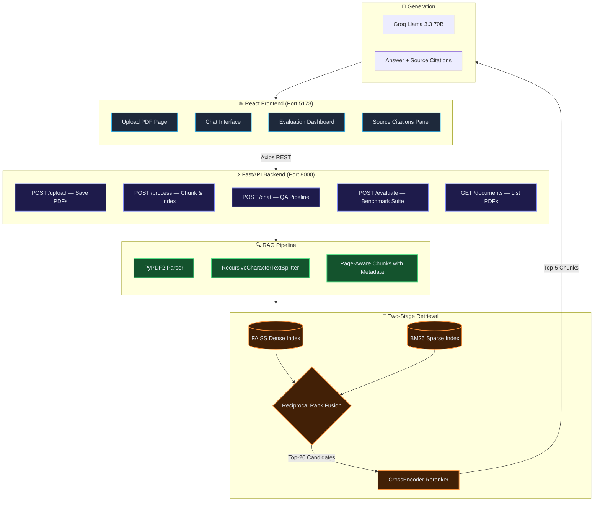

<div align="center">

# 🧠 HybridRAG-DocuAI

### Production-Style AI Document Assistant with Two-Stage Hybrid Retrieval

[](https://www.python.org/)
[](https://fastapi.tiangolo.com/)
[](https://react.dev/)
[](https://tailwindcss.com/)
[](https://groq.com/)
[](https://www.langchain.com/)
[](https://faiss.ai/)
[](LICENSE)

**Chat with your PDFs using enterprise-grade Hybrid RAG — FAISS Semantic Search + BM25 Keyword Retrieval + Reciprocal Rank Fusion + CrossEncoder Reranking + Groq Llama 3.3 70B**

[Features](#-features) • [Architecture](#-system-architecture) • [Tech Stack](#-tech-stack) • [Quick Start](#-quick-start) • [API Docs](#-api-endpoints) • [Evaluation](#-evaluation-dashboard)

</div>

---

## ✨ Features

| Feature | Description |
|--------|-------------|
| 📄 **PDF Upload & Indexing** | Upload multiple PDFs, auto-chunked with page-aware metadata |
| 🔍 **Hybrid Retrieval** | Combines FAISS semantic + BM25 keyword search via Reciprocal Rank Fusion |
| 🎯 **CrossEncoder Reranking** | Two-stage reranking using `ms-marco-MiniLM-L-6-v2` for precision |
| 🤖 **Groq LLM Generation** | Llama 3.3 70B answers grounded in your documents with source citations |
| 📑 **Source Citations** | Every answer shows the exact chunk, page number, filename & confidence score |
| 📊 **Evaluation Dashboard** | Benchmarks 4 retrieval configs — Precision@5, Recall@5, Latency |
| 🧪 **Synthetic QA Generator** | Auto-generates test questions from your own uploaded PDFs using LLM |
| 🌙 **Premium Dark UI** | Clean, modern React interface with glassmorphism and smooth animations |

---

## 🏗️ System Architecture

### Overall System Flow



### RAG Retrieval Pipeline

```
User Query
    │
    ├──────────────────────────────────┐
    │                                  │
    ▼                                  ▼
FAISS Dense Search              BM25 Keyword Search
(sentence-transformers           (BM25Okapi on tokenized
 all-MiniLM-L6-v2)               document corpus)
    │                                  │
    │       Top-N Candidates           │
    └──────────────┬───────────────────┘
                   │
                   ▼
      Reciprocal Rank Fusion (RRF)
      Score = Σ 1/(k + rank_i)
                   │
                   ▼
        Top-20 Fused Candidates
                   │
                   ▼
     CrossEncoder Reranker
     (ms-marco-MiniLM-L-6-v2)
     → Scores query-document pairs jointly
                   │
                   ▼
         Top-5 Reranked Chunks
                   │
                   ▼
       Groq Llama 3.3 70B (via LangChain)
       → Synthesizes grounded answer
       → Attaches page, source, confidence
                   │
                   ▼
      Final Answer + Citations
```

---

## 🛠️ Tech Stack

### Backend
| Technology | Purpose |
|-----------|---------|
| **FastAPI** | REST API framework with async support |
| **Uvicorn** | ASGI server |
| **LangChain** | LLM orchestration and chain management |
| **langchain-groq** | Groq API integration for Llama 3.3 70B |
| **FAISS** | Dense vector similarity search |
| **sentence-transformers** | Document & query embedding (`all-MiniLM-L6-v2`) |
| **BM25 (rank-bm25)** | Sparse keyword retrieval |
| **CrossEncoder** | Document reranking (`ms-marco-MiniLM-L-6-v2`) |
| **PyPDF2** | PDF text extraction |
| **PyYAML** | Configuration management |

### Frontend
| Technology | Purpose |
|-----------|---------|
| **React 18 + Vite** | SPA framework with fast HMR |
| **Tailwind CSS v4** | Utility-first styling |
| **Axios** | HTTP client for REST API calls |
| **Lucide React** | Icon library |

---

## 📁 Project Structure

```
HybridRAG-DocuAI/
│
├── backend/                          # FastAPI Application
│   ├── main.py                       # App entry point — CORS, routers
│   ├── routes/
│   │   ├── chat.py                   # POST /chat endpoint
│   │   ├── document.py               # Upload, process, delete PDFs
│   │   └── evaluate.py               # Evaluation suite trigger & results
│   ├── services/
│   │   ├── rag_service.py            # Full retrieval → rerank → LLM pipeline
│   │   ├── document_service.py       # PDF parsing & FAISS indexing
│   │   └── evaluation_service.py     # Synthetic QA generation & benchmarking
│   ├── retrieval/
│   │   ├── hybrid_retriever.py       # FAISS + BM25 + RRF fusion logic
│   │   └── vector_store.py           # FAISS index save/load wrapper
│   ├── reranker/
│   │   └── reranker.py               # CrossEncoder reranker & confidence scoring
│   ├── evaluation/
│   │   ├── evaluator.py              # Full benchmark suite runner
│   │   ├── metrics.py                # Precision@k, Recall@k
│   │   └── dummy_dataset.json        # Default evaluation QA pairs
│   ├── models/
│   │   └── llm_manager.py            # LangChain QA chain & citation prompt
│   └── utils/
│       ├── config_loader.py          # YAML config loader
│       ├── logging_utils.py          # Logger setup
│       └── pdf_processor.py          # Page-aware chunking with metadata
│
├── frontend/                         # React (Vite) Application
│   ├── src/
│   │   ├── components/
│   │   │   ├── Sidebar.jsx           # PDF list, upload controls
│   │   │   ├── ChatWindow.jsx        # Scrolling message history
│   │   │   ├── CitationCard.jsx      # Source chunk display
│   │   │   ├── UploadSection.jsx     # Drag-and-drop PDF uploader
│   │   │   └── EvaluationTable.jsx   # Metrics comparison table
│   │   ├── pages/
│   │   │   └── DashboardPage.jsx     # Evaluation dashboard layout
│   │   ├── utils/
│   │   │   └── api.js                # Axios base config & API calls
│   │   ├── App.jsx                   # Global layout & state management
│   │   ├── index.css                 # Tailwind v4 theme overrides
│   │   └── main.jsx                  # React DOM root
│   ├── index.html
│   ├── vite.config.js
│   └── package.json
│
├── evaluation/                       # Generated evaluation artifacts
│   ├── metrics.json                  # Latest benchmark results
│   ├── user_dataset.json             # Synthetic QA pairs from your PDFs
│   └── evaluation_report.csv         # Detailed per-query results
│
├── faiss_index/                      # Persisted FAISS vector index
├── config.yaml                       # System configuration
├── requirements.txt                  # Backend Python dependencies
└── README.md
```

---

## ⚡ Quick Start

### Prerequisites
- Python 3.9+
- Node.js 18+
- A free [Groq API Key](https://console.groq.com) (takes 1 minute to get)

---

### Step 1 — Clone the Repository

```bash
git clone https://github.com/Chakkasandeep/HybridRAG-DocuAI.git
cd HybridRAG-DocuAI
```

---

### Step 2 — Backend Setup

```bash
# Create Python virtual environment
python -m venv .venv

# Activate (Windows PowerShell)
.venv\Scripts\Activate.ps1

# Activate (macOS / Linux)
source .venv/bin/activate

# Install all dependencies
pip install -r requirements.txt
```

---

### Step 3 — Configure Environment

Create a `.env` file in the root directory:

```env
GROQ_API_KEY=your_groq_api_key_here
```

> 💡 **Alternatively**, you can paste the API key directly into the sidebar input field inside the app — no `.env` file needed.

---

### Step 4 — Start the Backend Server

```bash
# Make sure your virtualenv is activated
python -m uvicorn backend.main:app --host 127.0.0.1 --port 8000 --reload
```

Backend is now running at → **`http://localhost:8000`**
Interactive API docs → **`http://localhost:8000/docs`**

---

### Step 5 — Start the Frontend Dev Server

Open a **new terminal window**:

```bash
cd frontend
npm install
npm run dev
```

Frontend is now running at → **`http://localhost:5173`**

---

### Step 6 — Use the App

1. Open **`http://localhost:5173`** in your browser
2. Enter your **Groq API Key** in the sidebar
3. **Upload** one or more PDF files using the sidebar uploader
4. Click **Submit & Process** — this chunks and indexes your PDFs
5. Type a question in the chat box and get **grounded answers with citations**
6. Navigate to the **Evaluation Dashboard** and click **Run Evaluation Suite** to benchmark the retrieval pipeline against your own documents

---

## 🔌 API Endpoints

| Method | Endpoint | Description |
|--------|----------|-------------|
| `POST` | `/upload` | Upload one or more PDF files |
| `POST` | `/process` | Chunk, embed and index uploaded PDFs |
| `GET` | `/documents` | List all currently indexed documents |
| `DELETE` | `/documents/{filename}` | Remove a specific document |
| `POST` | `/chat` | Send a question and get a RAG-powered answer |
| `POST` | `/evaluate` | Trigger the benchmark evaluation suite |
| `GET` | `/evaluation/results` | Fetch the latest evaluation metrics |

> 📖 Full interactive docs available at **`http://localhost:8000/docs`** (Swagger UI)

---

## 📊 Evaluation Dashboard

The system includes a **built-in real-time evaluation suite** that benchmarks all four retrieval configurations:

| Configuration | Retrieval Method |
|--------------|-----------------|
| Semantic Search | FAISS dense vector similarity only |
| Keyword Search | BM25 sparse keyword retrieval only |
| Hybrid Search | FAISS + BM25 fused via RRF |
| Hybrid + Reranker | FAISS + BM25 + RRF + CrossEncoder |

### Metrics Displayed in Dashboard
- **Precision@5** — What % of the top-5 retrieved chunks are relevant?
- **Recall@5** — What % of all relevant chunks were found in the top-5?
- **Latency (ms)** — How fast does each configuration retrieve results?

### Dynamic Synthetic QA Generation
When you run the evaluation after uploading your own PDFs, the system:
1. Reads diverse chunks from your indexed documents
2. Calls Groq Llama 3.3 to generate **real, meaningful questions** about your content
3. Uses these questions (with source chunks as ground truth) to evaluate retrieval quality
4. Displays live results in the dashboard — no dummy data!

---

## ⚙️ Configuration

All system parameters are in [`config.yaml`](config.yaml):

```yaml
embedding:
  model_name: sentence-transformers/all-MiniLM-L6-v2
  device: cpu

retrieval:
  top_k_retrieve: 20
  fusion_method: rrf       # Options: rrf, weighted
  rrf_k: 60
  weights:
    semantic: 0.6
    keyword: 0.4

reranker:
  model_name: cross-encoder/ms-marco-MiniLM-L-6-v2
  device: cpu
  top_k_rerank: 5

llm:
  model_name: llama-3.3-70b-versatile
  temperature: 0.3
```

---

## 🗺️ Roadmap

- [ ] Multi-turn conversational memory
- [ ] Support for `.docx`, `.txt`, `.md` file types
- [ ] Streaming LLM responses (SSE)
- [ ] User authentication and per-user document isolation
- [ ] Docker Compose deployment setup

---

## 📄 License

This project is licensed under the [MIT License](LICENSE).

---

<div align="center">

Built with ❤️ by [Sandeep Chakka](https://github.com/Chakkasandeep)

⭐ **Star this repo if you found it helpful!**

</div>
